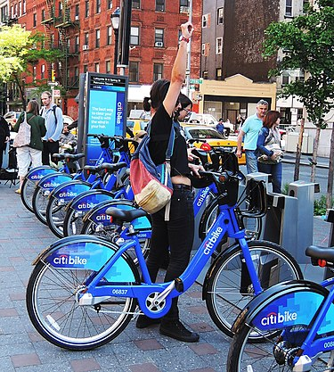

# Effect of Covid-19 on Citi Bike NY

 

Covid-19 struck without notice, leaving millions of businesses affected. Most did not make it. As we explore the data for the Citi Bike program in New York City, I want to make sure that the reader understands the severity of the data presented and how lucky this company was to remain open. 

The data is surprising; I encourage you to navigate all the tabs as they are not displayed in the final story. The reason for this is I concentrated on relevant topics such as the number of users, trip duration, gender, and seasons. 

For the first visualization shown in the story, we can see the total number of rides taken during 2020. This data, compared to other years (not shown), was lower almost by 30,000 rides. Next to it, we can see a detailed line graph representing the total rides done by users per month. This is crucial as it allows the viewer to know when the company was indeed affected. Most of it had to do with the local government to control the spread of Covid. You can see a massive reduction in numbers in March, know as "The beginning of Covid-19" in the US. Then you can see how it spiked after May when mandatory regulations faded and were less restrictive. Other public events, such as presidential elections, and the rollout of vaccines, might have influenced these spikes.

On the next slide, the user type is shown and how it got affected by Covid-19. This slide is significant as it shows how annual subscribed users canceled and possibly transitioned into a one-time purchase customer. This makes sense as they would not be using the bicycle every day or most days as they used to due to the restrictions. The year starts as expected, but in March, the sales plummet, and the daily customer becomes more significant than the membership customer from April through October. Then after already discuss political and global events, memberships seem to regain popularity. This analysis is critical to show that Covid-19 impacted and why it had it; if only percentages are offered, so much information would be left out. 

The next slide shows the user preference to use a bike in two critical seasons, Summer and Winter. It's imperative to point out that these seasons weren't as usual and that Covid-19 had a lot to do with that. With that said, you can see how users preferred to ride the bikes in the early morning hours in Summer but very few in Winter; this could be related to low temperatures in the wintertime. The popular time for both seasons seems to be 5:00 pm and 6:00 pm, which might correlate with the working schedule. One could say that these are peak hours because it's the end of the workday for so many. 

The third slide provides insight into the gender of the users and how they identify themselves as. New York is one of the more open-minded states on the east coast, is known for opening doors to different ways of thinking. Gender is a massive conversation at dinner tables that has to be shown here. This allows the company to target potential users according to the station or area that the bikes are located. Marketing strategies can be taken into place depending on the gender that rides the most on a specific station. The company must expand its "other" option to pick and get a better sense of the data freely. New York has more people identifying as "Other" than male and female, and therefore, it should take it into account. 

Last but not least, I included a map that allows the user to see all the stations in the NY area. The map displayed here is tied to the importance of gender in the City Bike program. It indicates the station where the "genders" start the trip, and it also allows the user to see the total of the trip durations by the station. This supports my previous point on how the company needs to expand the options of gender selection in the app and how it can benefit them in a marketing strategy.  
